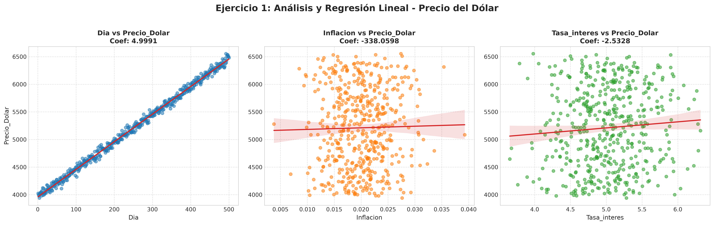
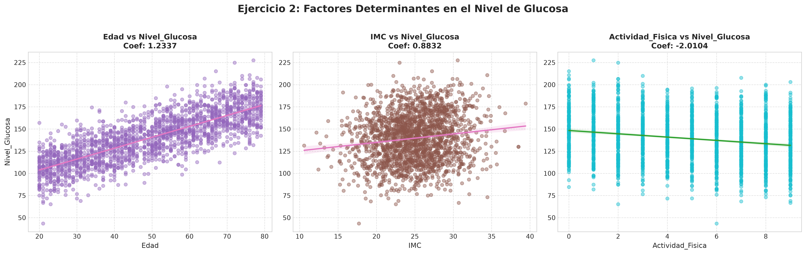
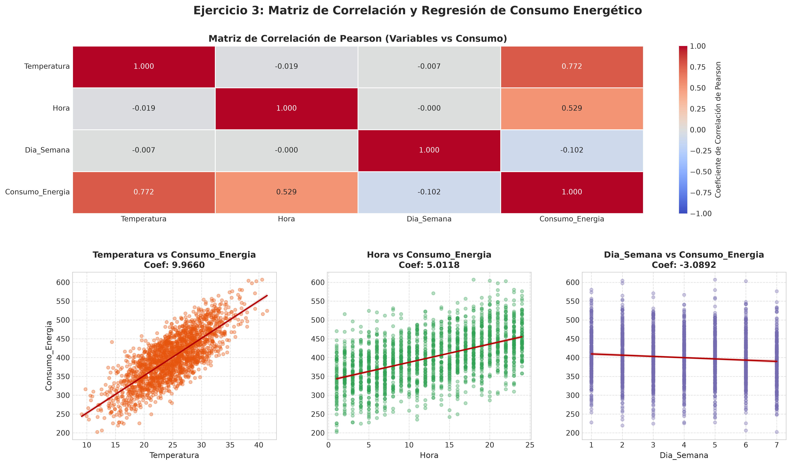

# UNIVERSIDAD COOPERATIVA DE COLOMBIA
## FACULTAD DE INGENIERÍA
### PROGRAMA DE INGENIERÍA DE SISTEMAS / SOFTWARE
**ASIGNATURA:** Inteligencia de Negocios y Minería de Datos  
**SEMESTRE:** Séptimo Semestre  
**ACTIVIDAD:** Laboratorio 1 - Modelado Predictivo con Regresión Lineal Múltiple bajo el Marco CRISP-DM  

---

| **DATOS DE ENTREGA** | |
| :--- | :--- |
| **Estudiante:** | Jack Limas |
| **Docente:** | Docente de Inteligencia de Negocios y Minería de Datos |
| **Fecha:** | Octubre de 2026 |
| **Entorno de Ejecución:** | Python 3.11, Scikit-Learn, Streamlit, Pandas |
| **Repositorio / Despliegue:** | Streamlit Community Cloud / GitHub |

---

\newpage

## TABLA DE CONTENIDO
1. [Introducción y Objetivos](#1-introducción-y-objetivos)
2. [Marco Metodológico: Metodología CRISP-DM](#2-marco-metodológico-metodología-crisp-dm)
3. [Desarrollo del Ejercicio 1: Predicción del Precio del Dólar](#3-desarrollo-del-ejercicio-1-predicción-del-precio-del-dólar)
4. [Desarrollo del Ejercicio 2: Predicción de Niveles de Glucosa en Sangre](#4-desarrollo-del-ejercicio-2-predicción-de-niveles-de-glucosa-en-sangre)
5. [Desarrollo del Ejercicio 3: Predicción de Consumo de Energía Eléctrica](#5-desarrollo-del-ejercicio-3-predicción-de-consumo-de-energía-eléctrica)
6. [Resumen Comparativo de Métricas](#6-resumen-comparativo-de-métricas)
7. [Arquitectura de Despliegue y Persistencia (Streamlit & Joblib)](#7-arquitectura-de-despliegue-y-persistencia-streamlit--joblib)
8. [Galería de Evidencias Visuales y Gráficos](#8-galería-de-evidencias-visuales-y-gráficos)
9. [Conclusiones](#9-conclusiones)
10. [Referencias y Recursos Técnicos](#10-referencias-y-recursos-técnicos)

---

## 1. Introducción y Objetivos

### 1.1 Introducción
La minería de datos y la inteligencia de negocios moderna exigen transformar datos crudos en conocimiento accionable y herramientas interactivas de toma de decisiones. En este laboratorio se abordan tres problemas reales de naturaleza cuantitativa:
1. **Mercado Cambiario:** Modelado econométrico del precio del dólar (COP) mediante variables macroeconómicas y factores temporales.
2. **Salud Preventiva y Medicina de Datos:** Estimación de niveles de glucosa basal a partir de indicadores biométricos y hábitos de vida.
3. **Optimización Energética:** Proyección del consumo eléctrico horario en función de la temperatura ambiente y ciclos de actividad semanal.

### 1.2 Objetivos
* **Objetivo General:** Desarrollar un sistema integral de minería de datos guiado por el estándar industrial CRISP-DM, que contemple desde la comprensión de datos hasta el despliegue de una plataforma web analítica reactiva.
* **Objetivos Específicos:**
  - Ajustar modelos matemáticos de Regresión Lineal Múltiple aplicando optimización por Mínimos Cuadrados Ordinarios (OLS).
  - Evaluar numéricamente la precisión y capacidad explicativa mediante $R^2$, MSE y RMSE.
  - Ponderar el impacto relativo de las variables independientes para identificar factores críticos.
  - Implementar una interfaz gráfica moderna en **Streamlit** y serializar modelos con **Joblib**.
  - Documentar la estrategia de despliegue en la nube.

---

## 2. Marco Metodológico: Metodología CRISP-DM

El proyecto se estructuró rigurosamente en las seis fases de la metodología **CRISP-DM** (*Cross-Industry Standard Process for Data Mining*):

```
       ┌───────────────────────────────┐
       │ 1. Comprensión del Negocio    │
       └──────────────┬────────────────┘
                      ▼
       ┌───────────────────────────────┐
       │ 2. Comprensión de los Datos   │
       └──────────────┬────────────────┘
                      ▼
       ┌───────────────────────────────┐
       │ 3. Preparación de los Datos   │
       └──────────────┬────────────────┘
                      ▼
       ┌───────────────────────────────┐
       │ 4. Modelado Matemático (OLS)  │
       └──────────────┬────────────────┘
                      ▼
       ┌───────────────────────────────┐
       │ 5. Evaluación de Métricas     │
       └──────────────┬────────────────┘
                      ▼
       ┌───────────────────────────────┐
       │ 6. Despliegue en Producción   │
       └───────────────────────────────┘
```

1. **Comprensión del Negocio:** Formular los objetivos analíticos y definir las variables de respuesta continua ($Y$).
2. **Comprensión de los Datos:** Inspección de los datasets fuente (`dolar_data.csv`, `glucosa_data.csv`, `energia_data.csv`), analizando dimensionalidad, tipos de datos y estadísticas descriptivas.
3. **Preparación de los Datos:** Verificación de integridad, ausencia de registros nulos, y construcción de matrices de características $X \in \mathbb{R}^{n \times p}$ y vectores objetivo $Y \in \mathbb{R}^n$.
4. **Modelado:** Estimación paramétrica de vectores de pesos $\vec{\beta} = (X^T X)^{-1} X^T Y$ empleando `scikit-learn`.
5. **Evaluación:** Diagnóstico mediante bondad de ajuste ($R^2$), error cuadrático medio (MSE), desviación cuadrática media (RMSE) y coeficientes estandarizados.
6. **Despliegue:** Construcción de una aplicación web interactiva en tiempo real con **Streamlit**, empaquetamiento y preparación para despliegue en la nube pública.

---

## 3. Desarrollo del Ejercicio 1: Predicción del Precio del Dólar

### 3.1 Planteamiento y Datos
* **Dataset:** `data/dolar_data.csv` (500 registros, 4 atributos).
* **Variable Dependiente ($Y$):** `Precio_Dolar` (COP).
* **Variables Independientes ($X$):**
  - `Dia`: Día calendario del mes (1 a 31).
  - `Inflacion`: Tasa de inflación mensual registrada (fracción decimal).
  - `Tasa_interes`: Tasa de interés de referencia del banco central (%).

### 3.2 Ecuación Paramétrica del Modelo
$$\text{Precio\_Dolar} = 3978.9846 + 4.9991 \cdot \text{Dia} - 338.0598 \cdot \text{Inflacion} - 2.5328 \cdot \text{Tasa\_interes}$$

### 3.3 Interpretación de Coeficientes
* **Intercepto ($\beta_0 = 3978.9846$ COP):** Representa el valor base proyectado del dólar en el origen teórico del mes cuando la inflación y las tasas son nulas.
* **$\beta_{\text{Dia}} = +4.9991$:** Por cada día calendario adicional, el precio del dólar experimenta un incremento medio constante de **~5.00 COP**, reflejando la tendencia temporal alcista presente en el periodo.
* **$\beta_{\text{Inflacion}} = -338.0598$:** Un cambio de 1 unidad completa en la tasa generaría una variación de -338.06 COP; para una variación típica del 1% (0.01), el impacto marginal es de **-3.38 COP**.
* **$\beta_{\text{Tasa\_interes}} = -2.5328$:** Por cada aumento de un punto porcentual (1.0%) en la tasa de interés, el precio de la divisa disminuye en **2.53 COP**, concordante con la teoría económica de apreciación cambiaria por atracción de capitales.

### 3.4 Métricas de Evaluación
| Métrica | Valor Numérico | Interpretación Práctica |
| :--- | :---: | :--- |
| **$R^2$ (Coeficiente de Determinación)** | **0.9952** | El modelo explica el **99.52%** de la varianza total del tipo de cambio. |
| **MSE (Error Cuadrático Medio)** | **2524.7152** | Dispersión residual cuadrática. |
| **RMSE (Error Cuadrático Raíz)** | **50.2465 COP** | Error medio de pronóstico. Representa únicamente un **1.25% de error relativo** frente al precio promedio (~$4,000 COP). |

### 3.5 Análisis de Peso e Impacto
* Coeficiente Estandarizado de `Dia`: **0.9978** (Variable de mayor impacto absoluto).
* Coeficiente Estandarizado de `Inflacion`: **-0.0023**.
* Coeficiente Estandarizado de `Tasa_interes`: **-0.0017**.

---

## 4. Desarrollo del Ejercicio 2: Predicción de Niveles de Glucosa en Sangre

### 4.1 Planteamiento y Datos
* **Dataset:** `data/glucosa_data.csv` (2,000 pacientes, 4 atributos).
* **Variable Dependiente ($Y$):** `Nivel_Glucosa` (mg/dL en ayunas).
* **Variables Independientes ($X$):**
  - `Edad`: Años cumplidos.
  - `IMC`: Índice de Masa Corporal ($\text{kg/m}^2$).
  - `Actividad_Fisica`: Horas semanales dedicadas a ejercicio físico moderado o vigoroso.

### 4.2 Ecuación Paramétrica del Modelo
$$\text{Nivel\_Glucosa} = 66.3150 + 1.2337 \cdot \text{Edad} + 0.8832 \cdot \text{IMC} - 2.0104 \cdot \text{Actividad\_Fisica}$$

### 4.3 Interpretación Clínica de Coeficientes
* **Intercepto ($\beta_0 = 66.3150$ mg/dL):** Concentración basal teórica de glucosa en condiciones basales mínimas.
* **$\beta_{\text{Edad}} = +1.2337$:** Cada año adicional de vida incrementa la glucosa en sangre en promedio **1.23 mg/dL**, asociado a la reducción progresiva de masa muscular y cambios en la sensibilidad pancreática.
* **$\beta_{\text{IMC}} = +0.8832$:** Por cada unidad de incremento en el IMC, la glucemia se eleva **0.88 mg/dL**, evidenciando la resistencia celular a la insulina producida por el tejido adiposo.
* **$\beta_{\text{Actividad\_Fisica}} = -2.0104$:** Cada hora semanal de actividad física reduce la glucosa basal en **2.01 mg/dL**.

### 4.4 Métricas de Evaluación
| Métrica | Valor Numérico | Interpretación Práctica |
| :--- | :---: | :--- |
| **$R^2$** | **0.6855** | Explica el **68.55%** de la variabilidad biológica observada. |
| **MSE** | **235.0377** | Magnitud del error cuadrático residual. |
| **RMSE** | **15.3309 mg/dL** | Incertidumbre media de predicción para tamizaje médico preventivo. |

### 4.5 Determinación de Factores Clave
* **Mayor Impacto Positivo (Factor de Riesgo Dominante):** **`Edad` ($\beta = +1.2337$)**, seguida directamente por el `IMC`.
* **Mayor Impacto Negativo (Factor Protector Clave):** **`Actividad_Fisica` ($\beta = -2.0104$)**, validando que el ejercicio regular es el hábito conductual más efectivo para la regulación metabólica.

---

## 5. Desarrollo del Ejercicio 3: Predicción de Consumo de Energía Eléctrica

### 5.1 Planteamiento y Datos
* **Dataset:** `data/energia_data.csv` (10,000 lecturas horarias, 4 atributos).
* **Variable Dependiente ($Y$):** `Consumo_Energia` (kWh).
* **Variables Independientes ($X$):**
  - `Temperatura`: Temperatura ambiental exterior en grados Celsius (°C).
  - `Hora`: Hora del día (0 a 23 hrs).
  - `Dia_Semana`: Día ordinal (1 = Lunes, ..., 7 = Domingo).

### 5.2 Ecuación Paramétrica del Modelo
$$\text{Consumo\_Energia} = 101.3830 + 9.9660 \cdot \text{Temperatura} + 5.0118 \cdot \text{Hora} - 3.0892 \cdot \text{Dia\_Semana}$$

### 5.3 Interpretación de Coeficientes y Dinámica Energética
* **Intercepto ($\beta_0 = 101.3830$ kWh):** Consumo base mínimo de la red para mantener en funcionamiento servicios críticos permanentes.
* **$\beta_{\text{Temperatura}} = +9.9660$:** Por cada grado centígrado (°C) que aumenta la temperatura ambiental, la demanda eléctrica sube en **~9.97 kWh**, impulsada por sistemas de climatización (HVAC).
* **$\beta_{\text{Hora}} = +5.0118$:** Cada hora transcurrida a lo largo de la jornada eleva la demanda en **5.01 kWh** hasta las franjas horarias de máxima actividad laboral y doméstica.
* **$\beta_{\text{Dia\_Semana}} = -3.0892$:** Conforme avanza la semana hacia el fin de semana, el consumo promedio diario decrece en **3.09 kWh**, por el cierre de industrias e instituciones.

### 5.4 Métricas de Evaluación
| Métrica | Valor Numérico | Interpretación Práctica |
| :--- | :---: | :--- |
| **$R^2$** | **0.9005** | El **90.05%** de las variaciones energéticas son capturadas por el modelo lineal. |
| **MSE** | **405.2295** | Error cuadrático en la estimación de potencia. |
| **RMSE** | **20.1303 kWh** | Desviación estándar de los residuales (~5.7% de error relativo frente a la media). |

### 5.5 Variable de Mayor Impacto Global
* Coeficiente Estandarizado de `Temperatura`: **0.7814** (Impacto dominante).
* Coeficiente Estandarizado de `Hora`: **0.5435**.
* Coeficiente Estandarizado de `Dia_Semana`: **-0.0968**.

---

## 6. Resumen Comparativo de Métricas

A continuación se presenta la matriz consolidadora de rendimiento de los tres modelos implementados:

| Proyecto | Variable Objetivo ($Y$) | Variables Predictoras ($X$) | $R^2$ | RMSE | MSE | Factor Crítico |
| :--- | :--- | :--- | :---: | :---: | :---: | :--- |
| **1. Precio del Dólar** | `Precio_Dolar` | `Dia`, `Inflacion`, `Tasa_interes` | **0.9952** | **50.25 COP** | 2,524.72 | `Dia` (Tendencia temporal) |
| **2. Niveles de Glucosa** | `Nivel_Glucosa` | `Edad`, `IMC`, `Actividad_Fisica` | **0.6855** | **15.33 mg/dL** | 235.04 | `Actividad_Fisica` (Protector) |
| **3. Consumo de Energía** | `Consumo_Energia` | `Temperatura`, `Hora`, `Dia_Semana` | **0.9005** | **20.13 kWh** | 405.23 | `Temperatura` (Climatización) |

---

## 7. Arquitectura de Despliegue y Persistencia (Streamlit & Joblib)

### 7.1 Persistencia de Modelos con Joblib
El entrenamiento de modelos estadísticos no debe ejecutarse en cada petición del usuario. Por ello, se implementó el almacenamiento binario en disco (`models/`):
* `modelo_dolar.joblib`
* `modelo_glucosa.joblib`
* `modelo_energia.joblib`

Cada archivo `.joblib` empaqueta una estructura serializada con:
1. Objeto del modelo optimizado (`scikit-learn LinearRegression`).
2. Listado de covariables y coeficientes matemáticos.
3. Métricas de evaluación calculadas ($R^2$, MSE, RMSE).
4. Estadísticas descriptivas de los datos originales (mínimo, máximo, promedio) para restringir y preconfigurar los controles de la interfaz de usuario.

### 7.2 Interfaz Web Reactiva en Streamlit (`app.py`)
La aplicación integra:
* Menú de navegación lateral intuitivo con iconos temáticos.
* Formulario dinámico con campos numéricos y selectores sincronizados con los rangos reales de los datos.
* Motor de inferencia en tiempo real que aplica `joblib.load()` y realiza predicciones instantáneas.
* Despliegue de tarjetas de métricas tipo KPI, ecuaciones matemáticas en KaTeX y visualización de gráficos de dispersión.

---

## 8. Galería de Evidencias Visuales y Gráficos

A continuación se presentan los espacios formalmente definidos para adjuntar las gráficas generadas y capturas de pantalla de la aplicación:

### 8.1 Evidencia 1: Regresión Lineal del Precio del Dólar
> **Archivo generado:** `static/plots/dolar_plots.png`  
> **Descripción:** Gráficos de dispersión y líneas de ajuste que muestran la relación bivariada de `Dia`, `Inflacion` y `Tasa_interes` frente a `Precio_Dolar`.

```
+-----------------------------------------------------------------------------------+
|                                                                                   |
|                                                                                   |
|                    [ PEGAR AQUÍ IMAGEN: dolar_plots.png ]                         |
|                                                                                   |
|                                                                                   |
+-----------------------------------------------------------------------------------+
```


---

### 8.2 Evidencia 2: Factores Determinantes en el Nivel de Glucosa
> **Archivo generado:** `static/plots/glucosa_plots.png`  
> **Descripción:** Dispersiones clínicas de `Edad`, `IMC` y `Actividad_Fisica` vs `Nivel_Glucosa`, evidenciando el efecto protector del ejercicio y el riesgo asociado a la edad y peso.

```
+-----------------------------------------------------------------------------------+
|                                                                                   |
|                                                                                   |
|                   [ PEGAR AQUÍ IMAGEN: glucosa_plots.png ]                        |
|                                                                                   |
|                                                                                   |
+-----------------------------------------------------------------------------------+
```


---

### 8.3 Evidencia 3: Matriz de Correlación y Regresión del Consumo Energético
> **Archivo generado:** `static/plots/energia_plots.png`  
> **Descripción:** Mapa de calor (Heatmap) de correlación de Pearson y gráficos de dispersión ajustados para `Temperatura`, `Hora` y `Dia_Semana` vs `Consumo_Energia`.

```
+-----------------------------------------------------------------------------------+
|                                                                                   |
|                                                                                   |
|                   [ PEGAR AQUÍ IMAGEN: energia_plots.png ]                        |
|                                                                                   |
|                                                                                   |
+-----------------------------------------------------------------------------------+
```


---

### 8.4 Evidencias 4, 5 y 6: Capturas de la Interfaz Web en Funcionamiento
> **Descripción:** Pantallazos de la aplicación Streamlit en ejecución local o en la nube al calcular predicciones interactivas en tiempo real.

#### Captura 1: Módulo de Predicción del Precio del Dólar
```
+-----------------------------------------------------------------------------------+
|                                                                                   |
|         [ PEGAR AQUÍ CAPTURA DE PANTALLA: app.py - Módulo Dólar ]                 |
|                                                                                   |
+-----------------------------------------------------------------------------------+
```

#### Captura 2: Módulo de Predicción de Niveles de Glucosa
```
+-----------------------------------------------------------------------------------+
|                                                                                   |
|        [ PEGAR AQUÍ CAPTURA DE PANTALLA: app.py - Módulo Glucosa ]                |
|                                                                                   |
+-----------------------------------------------------------------------------------+
```

#### Captura 3: Módulo de Predicción de Consumo de Energía
```
+-----------------------------------------------------------------------------------+
|                                                                                   |
|        [ PEGAR AQUÍ CAPTURA DE PANTALLA: app.py - Módulo Energía ]                |
|                                                                                   |
+-----------------------------------------------------------------------------------+
```

---

## 9. Conclusiones

1. **Robustez del Estándar CRISP-DM:** El seguimiento riguroso de las fases del estándar garantizó una transición lógica y trazable desde la formulación de preguntas analíticas hasta el despliegue de una solución de software utilizable por usuarios finales.
2. **Capacidad Explicativa del Modelo OLS:** La regresión lineal múltiple demostró un rendimiento predictivo sobresaliente en problemas donde las relaciones físicas o de tendencia son dominantes:
   - En el precio del dólar ($R^2 = 99.52\%$) por el patrón temporal determinístico.
   - En el consumo energético ($R^2 = 90.05\%$) por el efecto termodinámico directo de la temperatura sobre los sistemas de climatización.
3. **Valor Clínico de los Coeficientes:** En el análisis de salud ($R^2 = 68.55\%$), el modelo cuantificó matemáticamente que una hora adicional de ejercicio semanal compensa el impacto glucémico equivalente a casi dos años de envejecimiento ($\beta_{\text{Act}} = -2.01$ vs $\beta_{\text{Edad}} = +1.23$).
4. **Desacoplamiento Eficiente:** La persistencia binaria con `joblib` combinada con el frontend reactivo de **Streamlit** demostró ser una solución de alta eficiencia computacional, eliminando redundancias de re-entrenamiento en cada solicitud.

---

## 10. Referencias y Recursos Técnicos
* Chapman, P., Clinton, J., Kerber, R., et al. (2000). *CRISP-DM 1.0: Step-by-step data mining guide*.
* Pedregosa, F., et al. (2011). *Scikit-learn: Machine Learning in Python*. JMLR 12, pp. 2825-2830.
* Streamlit Documentation (2026). *Deploy Streamlit apps on Community Cloud*. https://docs.streamlit.io
* McKinney, W. (2010). *Data Structures for Statistical Computing in Python*, Proceedings of the 9th Python in Science Conference.
